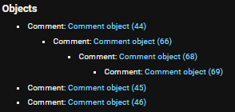

# Blog comments API

This project is the solution of the test task


## Features

- Add/edit/delete posts
- Add/edit/delete comments to posts
- Add/edit/delete replies to comments
- View all nested comments and replies up to level 3

+ Configured for PostgreSQL
+ Swagger documentation
+ Implemented with Django REST framework

>
## Installation

1) Clone the repo
```bash
 git clone git@github.com:EkaterinaMoroz/drf_blog_comments_api.git
```


3) Install dependecies
>a) With poetry:
       
- On windows run:
```bash
pip install poetry
```
- On Linux run:
```bash
curl -sSL https://raw.githubusercontent.com/python-poetry/poetry/master/get-poetry.py | python3 -    
```

Finally,
```bash
poetry install
```

>b) With requirements.txt:


```bash
pip install -r requirements.txt
```
4) Configure Database in blog/settings.py

5) Use the following commands to create models and run server

```bash
python .\manage.py makemigrations
```

```bash
python .\manage.py migrate
```
```bash
python .\manage.py runserver

```
## Documentation

After the server is set up, the documentation will be available at /swagger endpoint

>
## Usage/Examples

GET /
>
>
>GET /posts/2/
>
>
>
>Objects example hierarchy: 
>
>
>
>GET /posts/2/comments
>
>
>
>GET /posts/2/comment/66
>
>
>
>GET /posts/2/comment/66/replies
>
>


